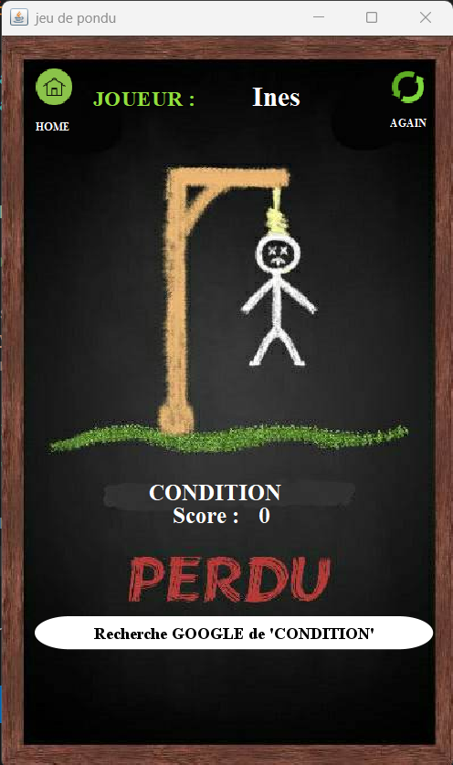

# 🎮 Hangman Game (Jeu du Pendu)
# 📌 Description:
A classic Hangman game built using Java with Swing for the graphical interface. Players must guess the hidden word by selecting letters, with a limited number of attempts before the game is over!

# 🔹 Tech Stack:
Language: Java  
UI Framework: Java Swing  

# 🔹 Game Features:

### 🟢 Game Menu  
  

### 🟢 Game Levels 
 

### 🔤 Gameplay  
  

### ❌ Game Gain  
  

### ❌ Game Over  
  
